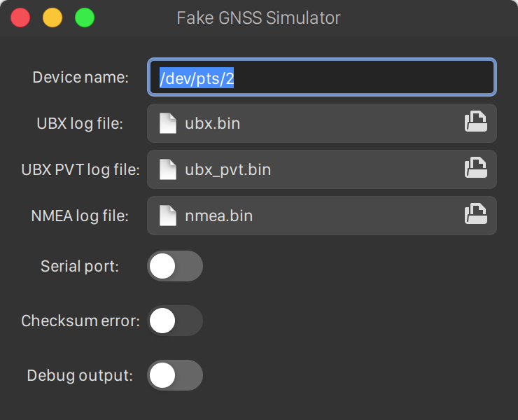

# Fake GNSS Simulator for Autoware

## Instructions before starting

1. Git clone this repository.

```
git clone git@github.com:ito-san/fake_sensor_tools.git
```

2. Install dependency.

```
sudo apt install libgtk-3-dev
```

3. Install `socat`.

```
sudo apt install socat
```

### <u>glade</u>

If you design a user interface, install `glade`.

```
sudo apt install glade
```

4. Make build this project.

```
cd fake_gnss_simulator
make
```

5. Create virtual serial ports

```

socat -d -d pty,raw,echo=0 pty,raw,echo=0

```

The output will be like this.
One of PTYs is used for [ublox](https://github.com/tier4/AutowareArchitectureProposal/tree/master/src/sensing/driver/ublox).<br>
Another is used for Fake GNSS Simulator.

```

2020/05/22 17:29:10 socat[42184] N PTY is /dev/pts/0
2020/05/22 17:29:10 socat[42184] N PTY is /dev/pts/2
2020/05/22 17:29:10 socat[42184] N starting data transfer loop with FDs [5,5] and [7,7]

```

6. Launch ublox_gps.

   Change serial port to use PTY before running a launch file.

7. Run Fake GNSS Simulator.

```
./fake_gnss_simulator
```

Enter device name, and choose a log file.<br>

- UBX log file: Only UBX messages must be included.
- NMEA log file: Only NMEA messages must be included.
  

Then, turn on the switch of `Serial Port` to open PTY serial port and transmit data.

### <u>Checksum error</u>

If you intend to generate checksum error, turn on the switch of `Checksum error`.<br>
The checksum value will be `??`.

### <u>Debug output</u>

If you want to see transmission data, turn on the switch of `Debug output`.
